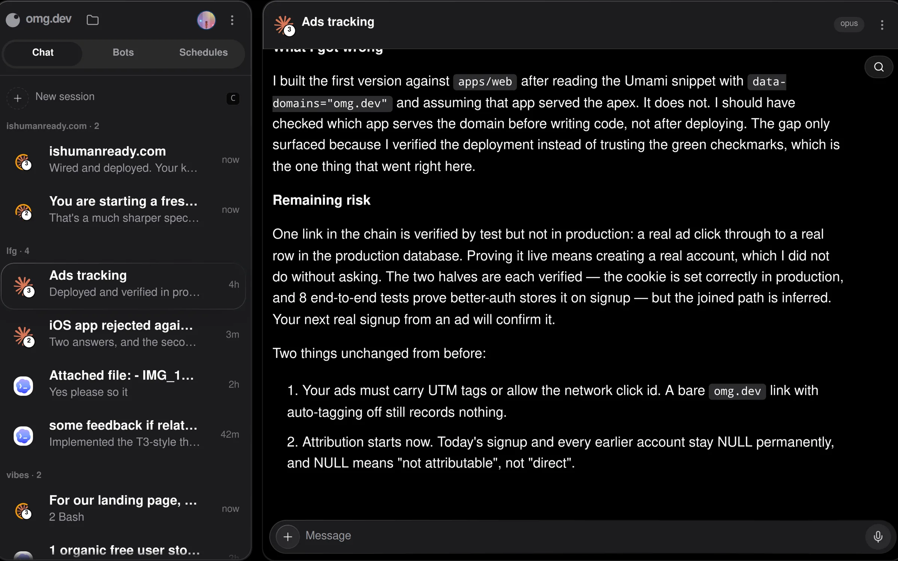
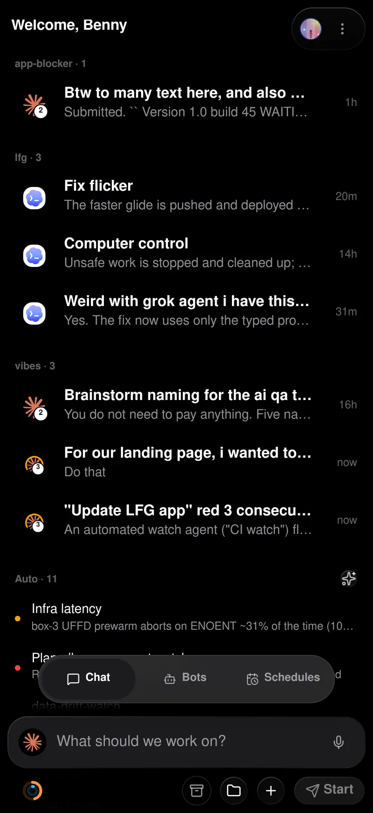

<a href="https://omg.dev">
  
</a>

# omg.dev

**The open-source parallel coding agent harness.**

Run coding agents on your own computer and control them from one web UI.
Install omg.dev locally, or start with a hosted Computer.

[](./LICENSE)
[](https://github.com/BennyKok/omg.dev/releases)
[](https://omg.dev/discord)

<p align="center">
  
  &nbsp;
  
</p>

## Install on your computer

Install the CLI with [Bun](https://bun.sh), then set up the local control plane:

```bash
bun install --global @omg-dev/cli && omg computer setup
```

Open [http://localhost:8766](http://localhost:8766).

Local setup needs no omg.dev account. It supports Debian or Ubuntu Linux and
macOS. On Linux, run it as a normal user with `sudo` access. Do not run it as
`root`.

Open **Settings → Coding agents** to install or connect an agent. omg.dev
supports Claude Code, Codex, Grok, Cursor, fx, OpenCode, Jcode, GitHub Copilot,
and Pi. You authenticate with the agent provider.

## Use the hosted version

Use a hosted Computer if you do not want to install or maintain a local server.
It runs omg.dev in the cloud and opens from your browser.

[**Start with a hosted Computer →**](https://app.omg.dev/)

## What you get

- Run several coding-agent sessions in parallel.
- Read transcripts and send follow-up instructions from the web UI.
- Use Chat, Bots, Schedules, and Notifications in one place.
- Keep managed sessions running when the web UI disconnects.
- Use your existing agent subscriptions or API keys.

## Remote access and security

The local server binds to `127.0.0.1` by default and has no built-in
authentication. Do not expose it directly to the public internet.

To use the local UI from your phone, serve it privately through Tailscale:

```bash
OMG_TAILSCALE_SERVE=1 omg setup
```

Sign in to Tailscale if setup asks you to. See
[remote access](./docs/remote-access.md) and [SECURITY.md](./SECURITY.md) before
you share access.

## Manage a local install

```bash
omg computer status    # check the install
omg computer update    # install the latest release
omg doctor             # create a sanitized diagnostic report
omg computer uninstall # remove omg.dev and keep sessions and config
```

## Develop from source

```bash
git clone https://github.com/BennyKok/omg.dev.git
cd omg.dev
bun install
cp .env.example .env
bun run serve
```

The macOS-first desktop shell uses Electrobun with a Bun main process. See
[desktop development](./desktop/README.md).

Read [CONTRIBUTING.md](./CONTRIBUTING.md) before you open a pull request. Ask
for help in [Discord](https://omg.dev/discord).

## License

[MIT](./LICENSE)
