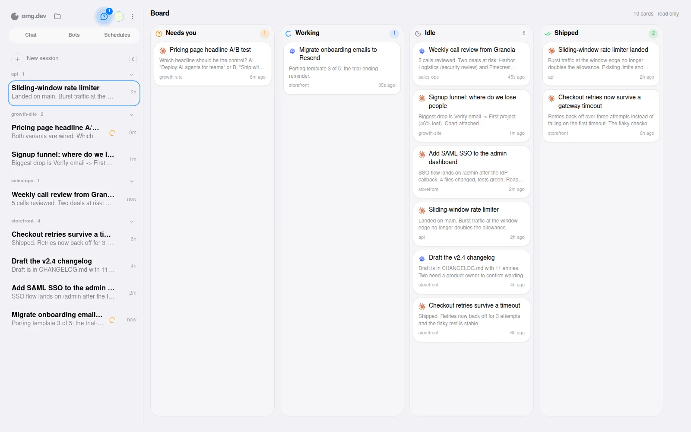
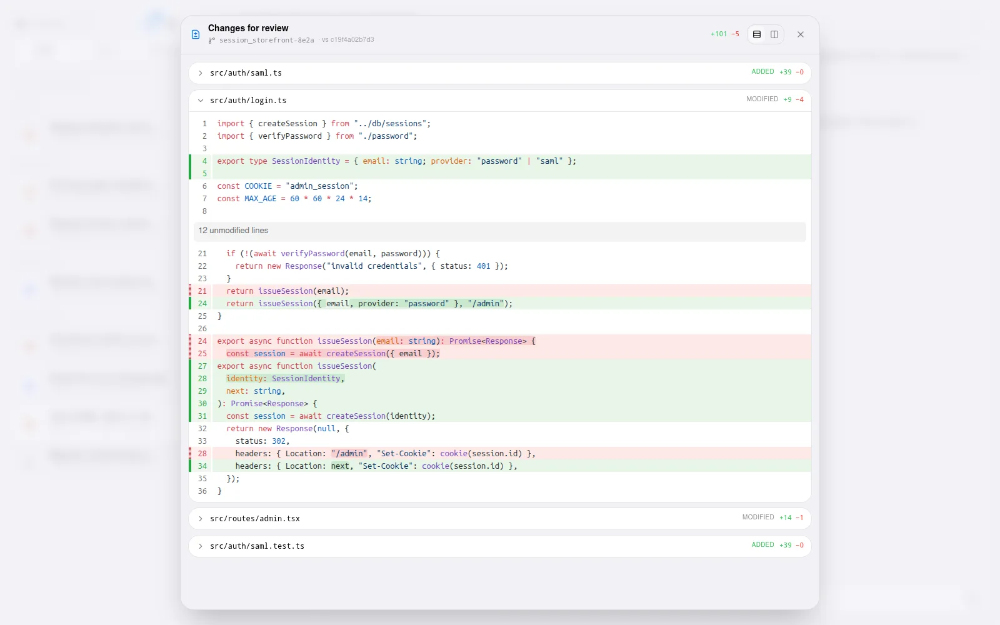
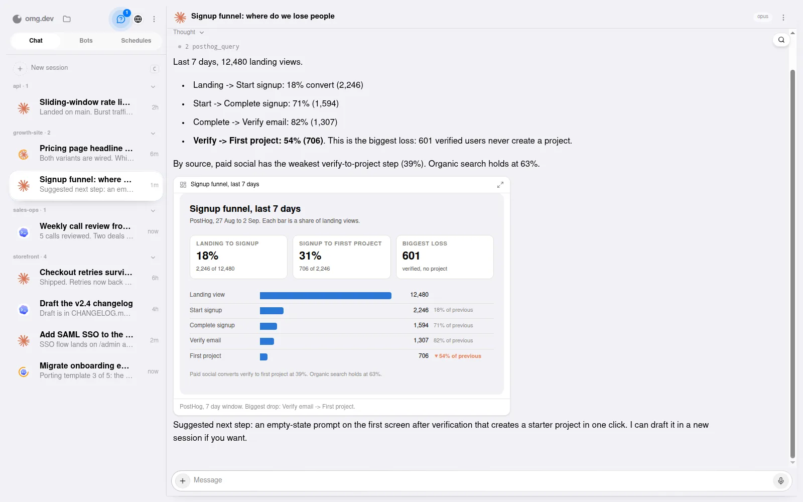
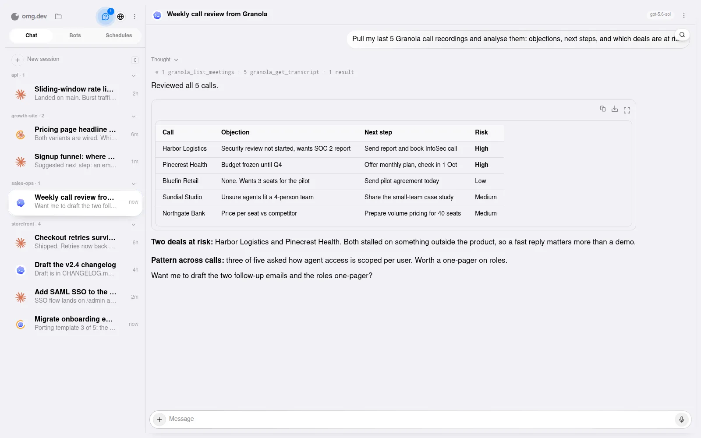
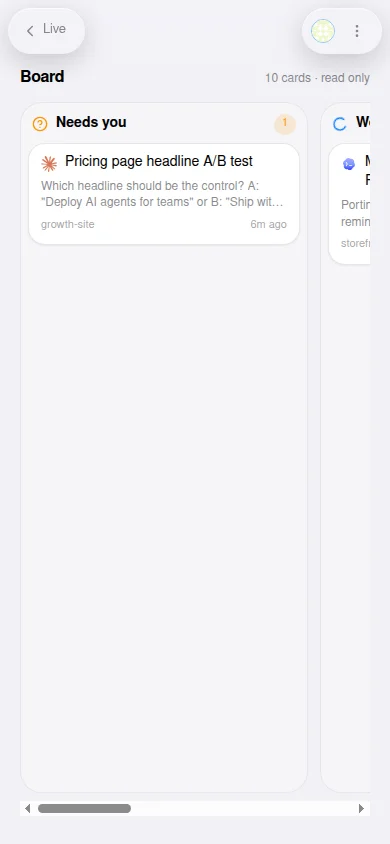
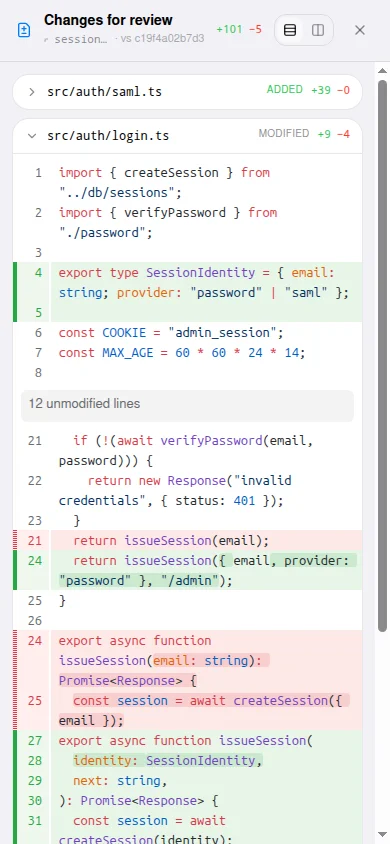
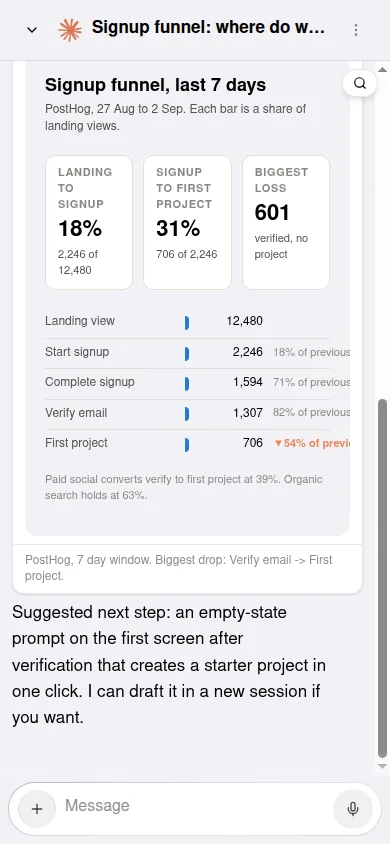
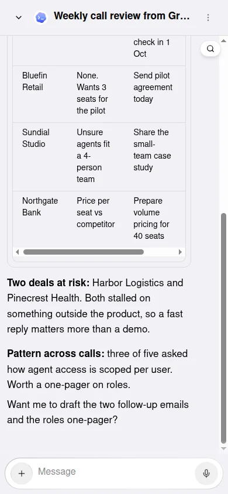

<a href="https://omg.dev">
  
</a>

# omg.dev

**Not 10 interfaces. One portal for all your agents.**

Increase AI adoption in your company from 5% to 50%. omg.dev is the
open-source parallel coding agent harness: run coding agents on your own
computer and control them from one web UI. Install omg.dev locally, or start
with a hosted Computer.

[](./LICENSE)
[](https://github.com/BennyKok/omg.dev/releases)
[](https://github.com/BennyKok/omg.dev/releases/download/desktop-preview/macos-arm64-omg.dev.dmg)
[](https://omg.dev/discord)

<p align="center">
  
  &nbsp;
  
</p>

## Install on your computer

Install the CLI with [Bun](https://bun.sh), then set up the local control plane:

```bash
bun install --global @omg-dev/cli && omg computer setup
```

Open [http://localhost:8766](http://localhost:8766).

Local setup needs no omg.dev account. It supports Debian or Ubuntu Linux and
macOS. On Linux, run it as a normal user with `sudo` access. Do not run it as
`root`.

Open **Settings → Coding agents** to install or connect an agent. omg.dev
supports Claude Code, Codex, Grok, Cursor, fx, OpenCode, Jcode, GitHub Copilot,
and Pi. You authenticate with the agent provider.

### Try the macOS desktop preview

The desktop app supports Apple Silicon. It uses the local control plane, so run
the install command above before you open the app.

[**Download omg.dev for macOS →**](https://github.com/BennyKok/omg.dev/releases/download/desktop-preview/macos-arm64-omg.dev.dmg)

Open the DMG and move `omg.dev.app` to Applications. This preview is not signed
or notarized yet. For the first launch, Control-click the app, select **Open**,
then select **Open** again. If macOS still blocks it, use **System Settings →
Privacy & Security → Open Anyway**.

## Use the hosted version

Use a hosted Computer if you do not want to install or maintain a local server.
It runs omg.dev in the cloud and opens from your browser.

[**Start with a hosted Computer →**](https://app.omg.dev/)

## Built for every role on the team

One portal, optimized for every role on the team. PMs, engineers, growth and
sales work in the same place, see the same sessions and the same data, and stay
on the same page. Every capture is a real screen from a running omg.dev
instance.

<table>
  <tr>
    <td width="50%">
      
      <p><strong>PM: See every agent on one board.</strong><br />
      Needs you, Working, Idle, Shipped. Answer the question that blocks an agent and read what shipped, without opening a session.</p>
    </td>
    <td width="50%">
      
      <p><strong>Engineer: Review the diff before it lands.</strong><br />
      Each session works in its own worktree. Open the change bar, read the patch file by file, and merge when the tests are green.</p>
    </td>
  </tr>
  <tr>
    <td width="50%">
      
      <p><strong>Growth: Visualize the data from your database.</strong><br />
      Ask in chat and the agent answers with an interactive chart built from your analytics or database, in the same thread. The whole team sees the same numbers.</p>
    </td>
    <td width="50%">
      
      <p><strong>Sales: Turn call recordings into next steps.</strong><br />
      Pull your last five Granola calls, get objections and risk per deal, and send the follow-ups from the same thread.</p>
    </td>
  </tr>
</table>

The same four views on a phone:

<p align="center">
  
  
  
  
</p>

## What you get

- Run several coding-agent sessions in parallel.
- Read transcripts and send follow-up instructions from the web UI.
- Use Chat, Bots, Schedules, and Notifications in one place.
- Keep managed sessions running when the web UI disconnects.
- Use your existing agent subscriptions or API keys.

## Remote access and security

The local server binds to `127.0.0.1` by default and has no built-in
authentication. Do not expose it directly to the public internet.

To use the local UI from your phone, serve it privately through Tailscale:

```bash
OMG_TAILSCALE_SERVE=1 omg setup
```

Sign in to Tailscale if setup asks you to. See
[remote access](./docs/remote-access.md) and [SECURITY.md](./SECURITY.md) before
you share access.

## Manage a local install

```bash
omg computer status    # check the install
omg computer update    # install the latest release
omg doctor             # create a sanitized diagnostic report
omg computer uninstall # remove omg.dev and keep sessions and config
```

## Develop from source

```bash
git clone https://github.com/BennyKok/omg.dev.git
cd omg.dev
bun install
cp .env.example .env
bun run serve
```

The macOS-first desktop shell uses Electrobun with a Bun main process. See
[desktop development](./desktop/README.md).

Read [CONTRIBUTING.md](./CONTRIBUTING.md) before you open a pull request. Ask
for help in [Discord](https://omg.dev/discord).

## License

[MIT](./LICENSE)
